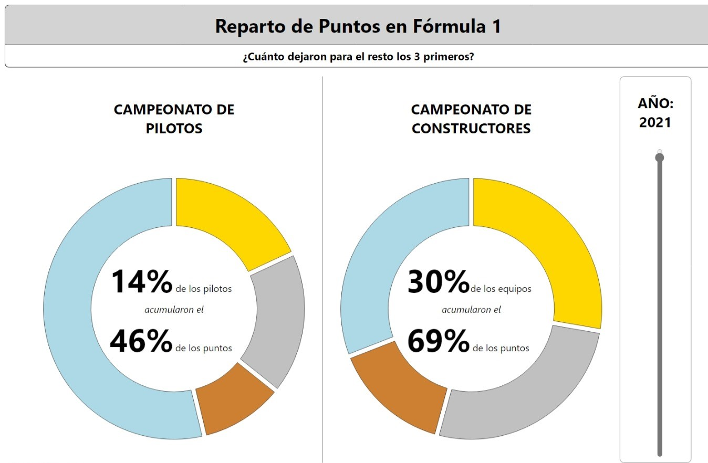

# Reparto de Puntos en Fórmula 1

Este trabajo es parte de la asignatura _Diseño y Evaluación de Sistemas Interactivos_, parte del currículum de Ingeniería Informática de la Universidad de Valladolid. La intención es crear una representación usando HTML y JavaScript que evidencie las desigualdades de este deporte, en el que una minoría de competidores suelen obtener la gran mayoría de triunfos en una temporada sobre el resto de la parrilla que sufre con coches en gran desventaja.

## Datos

La fuente de los datos es la siguiente: _Formula 1 World Championship (1950 - 2023)_ de Vopani. El repositorio con los datos se puede consultar en [Kaggle](https://www.kaggle.com/datasets/rohanrao/formula-1-world-championship-1950-2020).
Los datos originales fueron tratados para su fácil representación, y son los que están en la carpeta [data](/data/).

## Visualización y Funcionalidades

La visualización presenta con una animación dos gráficos de _donut_, uno para el campeonato de pilotos y otro para el de constructores dentro de cada año.
Se representan los 3 primeros pilotos/equipos por separado y luego el resto agregados en una cuarta categoría.
Dentro de cada gráfico se proporciona el porcentaje que suponen esos 3 primeros sobre el total de competidores y su cantidad de puntos sobre el total de puntos de la temporada.

Para cambiar entre cualquier año entre 1950 y 2022 se puede usar el deslizador de la derecha, teniendo en cuenta que no hay registros del campeonato de constructores para años anteriores a 1958.
Cada _trozo_ del donut reacciona al pasar el puntero del ratón por encima mostrando los datos de ese competidor (o en el caso del trozo asignado al resto, el número de competidores agregados) y su número de puntos.

Se puede acceder a la visualización [aquí](https://juuaancode.github.io/Formula1/).
