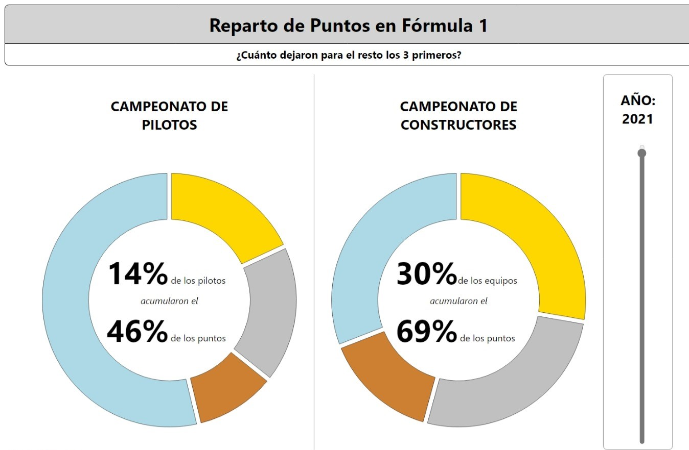

# Point Distribution in Formula 1

This project is homework from the subject _Diseño y Evaluación de Sistemas Interactivos_ (Design and Evaluation of Interactive Systems), part of Computer Science at University of Valladolid. The purpose of this project is to create a visualization using HTML and JavaScript showing the inequalities of this sport and how a few competitors take most wins throughout each season over the rest of the grid.

## Data

The source dataset is _Formula 1 World Championship (1950 - 2023)_ from Vopani. The repository with the data can be accessed in [Kaggle](https://www.kaggle.com/datasets/rohanrao/formula-1-world-championship-1950-2020).
The original data was transformed to make the representation easier, and that is what is present at the [data](/data/) folder.

## Visualization and Features

The visualization presents two _donut_ graphs with an animation, one for the pilots’ championship and another for the constructors, both for a single year.
The 3 first pilots/teams are painted separately, and the rest are aggregated on a single fourth category.
Inside of each graph there is text displaying how much those 3 first amount over the total of competitors, and how many points the have over the total of that season.

The user can change the year shown between 1950 and 2022 using the slider on the right. Keep in mind there are no records for the constructors’ championship before 1958.
Each _piece_ of the donut reacts to the mouse pointer showing data of each competitor (in the case of the fourth piece it shows the number of aggregated competitors) and their number of points.

You can access the visualization [here]().
